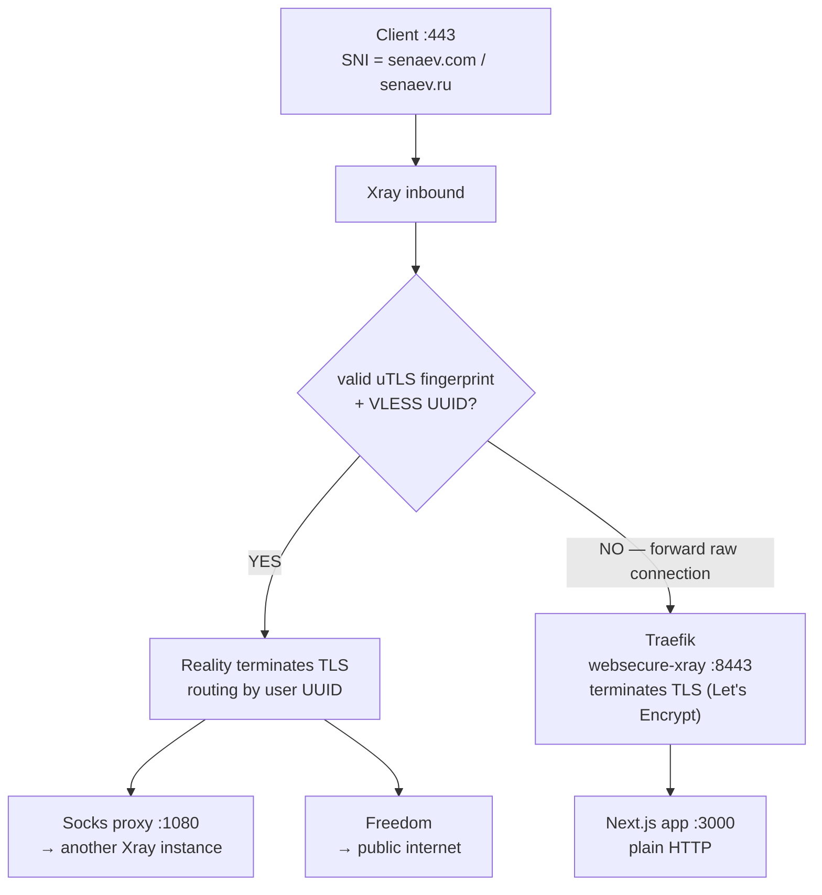

# VPN Architecture

Xray VPN with VLESS+Reality protocol, deployed across 4 VPS nodes. Clients receive connection configs via the `vpn-subscription` web service.

Key generation: see `XRAY_VPN.md`.

## Components

### Xray VPN servers (4 instances)

Each instance runs as a Kubernetes Deployment in the `senaev-com` namespace on its respective node:

Inter-instance routing uses internal Socks proxies (port 1080). Instances chain traffic to each other before exiting to the internet.

### vpn-subscription service

Node.js/Fastify service at `vpn-subscription.senaev.com`. Authenticated by a secret URL path (`VPN_SUBSCRIPTION_SECRET`).

**GET `/:secret`** — returns connection config or HTML instructions based on `User-Agent`:
- VPN apps (HiddifyNext, Happ): subscription body with 5 VLESS entries
- Browsers: HTML page with setup instructions and deep links

**POST `/:secret`** — receives error reports from clients, forwards to Telegram via `cluster-helper`.

## Network flow

Port 443 on each VPS serves both the public website and VPN clients. Traefik routes by SNI: TLS connections that match the VPN SNI are passed through raw to Xray (Reality terminates TLS); everything else has TLS terminated by Traefik (Let's Encrypt) and is forwarded plain HTTP to the Next.js app.

## Config rendering

Xray config is generated at pod start by an initContainer (node:22-alpine):

1. ConfigMap holds the config template with placeholders: `{XRAY_REALITY_PRIVATE_KEY}`, `{XRAY_USER_UUID:seed}`
2. InitContainer substitutes secrets from environment variables
3. UUID derivation: `SHA256(baseUUID:seed).substring(0,32)` formatted as UUID — same logic used in both Xray config and `vpn-subscription`
4. Final config written to `/etc/xray/config.json`

## Secrets

All secrets live in HashiCorp Vault under key `senaev-com-kv`, synced to Kubernetes via the ExternalSecrets operator:

| Secret | Purpose |
|---|---|
| `XRAY_USER_UUID` | Base UUID for per-user derivation |
| `XRAY_REALITY_PRIVATE_KEY` | X25519 private key (server) |
| `XRAY_REALITY_PUBLIC_KEY` | X25519 public key (sent to clients) |
| `VPN_SUBSCRIPTION_SECRET` | URL auth token |
| `VPN_SUBSCRIPTION_CHAT` | Telegram group URL for error reports |

Pod reloader watches both the Vault secret and config ConfigMap — any change triggers a rolling restart.
